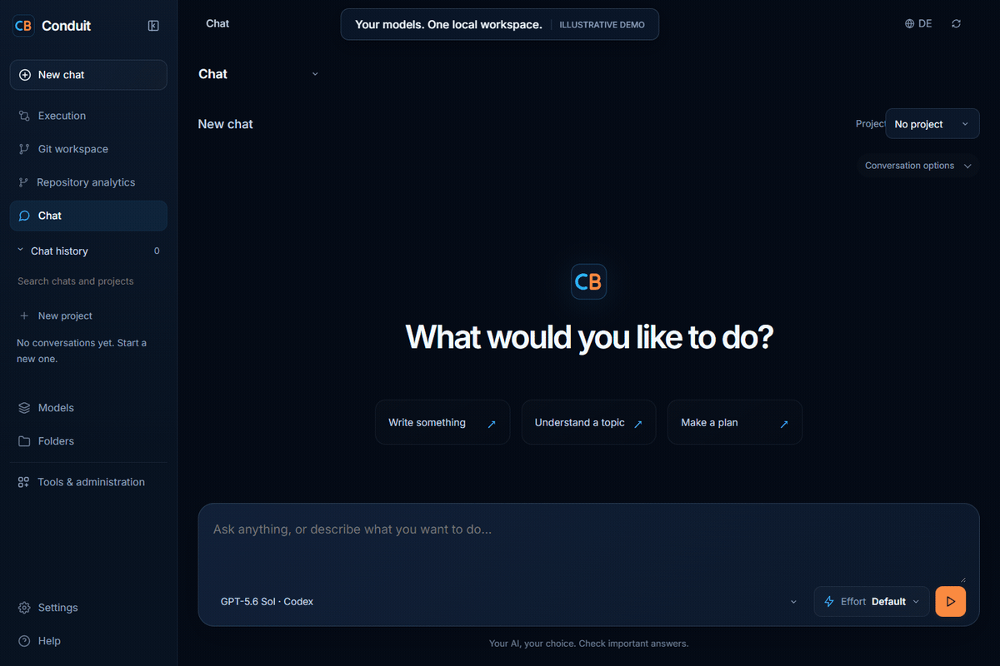

# Conduit Bridge

[](https://github.com/elvatis/conduit-bridge/actions/workflows/aahp-verify.yml)
[](https://github.com/homeofe/supply-chain-guard)

**Current version:** 0.10.0

Conduit Bridge is a local, OpenAI-compatible gateway for the AI tools you
already use. It gives desktop clients one loopback endpoint while keeping API
keys, authenticated coding CLIs, local models, conversations, and workspace
access under explicit local control. It runs on Windows Desktop and Linux
Desktop at `127.0.0.1:31338`.



The tour uses illustrative data. [Record the English demo](assets/README.md)
or follow the [workspace examples](examples/workspace/README.md).

## What it does

| Need | Conduit Bridge provides |
| --- | --- |
| One client endpoint | OpenAI-compatible chat, responses, embeddings, model discovery, metrics, events, and comparison endpoints. |
| Provider choice | Direct APIs, authenticated coding CLIs, LM Studio, and optional local BitNet inference remain separate and independently configurable. |
| Productive local work | Chat projects, execution evidence, Git history and diffs, repository analytics, models, budgets, pipelines, governance, and diagnostics. |
| Controlled automation | Bounded agent runs, approval gates, scoped workspaces, versioned skills, provider profiles, and usage estimates. |
| Private local state | Every platform conversation stays on this device until explicit deletion. Encrypted SQLite is the default, with backup and restore. |
| Message vault | Search every conversation message with SQLite full text or tgrep regex. Recurring local BitNet scans propose improved prompts with source links. |
| Fast code lookup | Optional local `tgrep` indexing with a native ripgrep fallback. No source code is sent to a model to perform a search. |

## Quick start

Install Git and Node.js 24 or newer, then clone, build and start the bridge:

```bash
git clone https://github.com/elvatis/conduit-bridge.git
cd conduit-bridge
npm install
npm run build
node dist/cli.js start
```

For an existing checkout, start with `npm install` in its root directory.
In Windows PowerShell, use `npm.cmd` if the npm script shim is blocked, and
`curl.exe` for single-line curl commands. Multiline `bash` examples need Bash;
the [BitNet walkthrough](docs/guides/bitnet.md) provides native PowerShell requests.

Keep the terminal open: `start` runs in the foreground; **Ctrl+C** stops it.
Open [the local dashboard](http://127.0.0.1:31338/) and select a connected model.
The bridge listens only on loopback by default. Installing Conduit does not
install an inference engine or download model weights. If you are starting
without a provider, follow [local BitNet setup](#install-llama-server-and-bitnet)
or connect one of the providers below before sending a chat.

In a second terminal, confirm health and inspect the available model IDs:

```bash
node dist/cli.js status
curl http://127.0.0.1:31338/health
curl http://127.0.0.1:31338/v1/models
```

For a fuller first-run walkthrough, including provider setup and a first chat
request, see [Getting started](docs/guides/getting-started.md).

## Choose a provider

The provider name describes the transport that Conduit uses. A CLI login and an
API key are intentionally independent: signing in to a coding CLI never
silently enables the matching paid API.

| Transport | Providers | Setup |
| --- | --- | --- |
| Direct API | `claude-api`, `codex-api`, `gemini-api`, `openrouter-api`, `perplexity-api` | Save a key through Settings or set the documented environment variable. |
| Coding CLI | `cli-claude`, `cli-codex`, `cli-gemini`, `cli-grok` | Install and authenticate the provider's official CLI as the same desktop user. |
| Local | `lmstudio`, `bitnet` | LM Studio uses its running local service. [Install and configure llama-server with BitNet](docs/guides/bitnet.md) for CPU inference started with Conduit. |

The dashboard lists each transport separately. It also groups model menus with
CLI models first, so an installed coding CLI remains the natural starting point
for a new chat.

See [provider setup and model catalogs](docs/guides/getting-started.md#connect-a-provider)
for environment-variable names, model discovery, and model overrides.

## Install llama-server and BitNet

For local BitNet, you need **two files plus a chat template**: the native
`llama-server` executable, Microsoft's `ggml-model-i2_s.gguf` weights, and the
supplied 2B-4T template. Microsoft's BitNet source includes llama.cpp; the
provided build helper produces the required `llama-server`. A separate Meta
Llama model, Ollama or LM Studio installation is not required for this route.

The [complete installation walkthrough](docs/guides/bitnet.md) provides
PowerShell commands, download links, expected results and recovery steps:

| Step | What to do | Check before continuing |
| --- | --- | --- |
| 1 | [Install the C++/Clang build tools](docs/guides/bitnet.md#prepare-the-computer), Git and Node.js. | Version checks succeed. |
| 2 | [Build the BitNet-compatible llama-server](docs/guides/bitnet.md#build-the-native-server) with `./scripts/bitnet/build-windows.ps1` from a source checkout. | The resulting executable runs with `--version`. |
| 3 | [Download the official 2B-4T GGUF](docs/guides/bitnet.md#download-the-model), about 1.19 GB, outside the repository. | File size and SHA-256 match. |
| 4 | [Configure `.env`](docs/guides/bitnet.md#configure-the-bridge) with absolute executable, model and template paths. | All three files exist; tokenizer/template settings match the model. |
| 5 | [Restart and check both services](docs/guides/bitnet.md#start-and-check-both-services). | Ports 31338 and 8080 respond; BitNet is connected. |
| 6 | [Send the first request](docs/guides/bitnet.md#send-an-inference-request) using `bitnet/auto`. | A short answer arrives in PowerShell and Webchat. |

This is the validated **Windows x64 CPU route**, using a pinned native build
without Python or Conda. It downloads source during the build; you download
the model explicitly. Linux users should read the
[platform-specific limits and upstream route](docs/guides/bitnet.md#linux-and-other-installations).
After setup, inference runs locally without an API key.

Seeing `bitnet/auto` or `bitnet/2B-4T` in a model menu does not prove that a model
is installed: these aliases do not download or switch models. The guide checks
native health, Conduit's connection and a real answer separately. If a step
fails, use the [troubleshooting table](docs/guides/bitnet.md#troubleshooting)
or [foreground loading diagnostic](docs/guides/bitnet.md#inspect-a-native-startup-failure).
Once the first chat works, continue with
[daily startup and shutdown](docs/guides/bitnet.md#everyday-startup-and-shutdown)
and optional [desktop autostart](docs/guides/autostart.md).

## Dashboard and work routing

The browser dashboard is branded as **Conduit**, the Elvatis control plane for
local AI work. It uses system typography, translucent navigation, opaque content,
capsule controls, responsive layouts, and English or German labels.
The main workspace brings together Webchat, Memory, Assistants, Tasks and
Administration. Separate sections cover provider health, model catalogs,
budgets, usage, pipelines, governance, diagnostics and activity. Model pickers
are searchable and put authenticated CLI models first, followed by local and
API transports. The complete transport ID stays visible so an operator can
tell which account or local service will answer.

Execution adds a hierarchical task view, provider events and a plan drawer.
The shared Effort popover includes a separate Faster speed switch where supported.
Git workspace shows branches, worktrees, commit history and diffs; Repository
analytics charts committed source history with inspectable snapshots and export.
Drag the navigation's right edge to adjust its width, or focus the divider and
use the arrow keys. The width and language preference survive a browser reload.
See [Execution and repository workspace](docs/guides/execution-workspace.md)
for behavior, permissions and current limits.

**Ctrl+K** finds any page. A brief first-visit offer introduces the main actions;
**Help** reopens it and provides examples that populate unsent drafts. The
dedicated [examples section](docs/examples/README.md) explains expected results.
**Insights** uses local BitNet to gather results, decisions, lessons and open
tasks from your own saved chats, with source excerpts and resumable progress.
See [coverage and model limits](docs/guides/session-insights.md).

The routing skill classifies a request before execution and returns a primary
model plus ordered fallbacks. The route is a recommendation subject to the
models currently advertised by `/v1/models`, provider policy, credentials and
budget limits. Private or offline wording always remains local.

| Work | Primary model | Fallback direction |
| --- | --- | --- |
| Product and reliability | `api-openrouter/openai/gpt-6-astra` | GPT-5.6 Sol, Fable 5.1, Opus 5 |
| Architecture and difficult design | `api-openrouter/openai/gpt-6-astra` | Opus 5, Fable 5.1, GPT-5.6 Sol |
| Implementation and tests | `cli-codex/gpt-5.6-sol` | GPT-6 Astra, Fable 5.1, Fable 5, Terra, Codex Spark |
| Security and hardening | `cli-codex/gpt-daybreak-blue-latest` | GPT-6 Astra, GPT-5.6 Sol, Fable 5.1 |
| Independent review, analysis and synthesis | `cli-claude/claude-fable-5-1` | Opus 5, GPT-6 Astra, Fable 5, GPT-5.6 Sol |
| Documentation and release writing | `cli-claude/claude-fable-5` | Fable 5.1, Sonnet 5, GPT-5.6 Sol |
| Deep research | `cli-claude/claude-opus-5` | Fable 5, Fable 5.1, Anthropic via OpenRouter |
| Everyday assistance and complex reasoning | `cli-claude/claude-fable-5` | Fable 5.1, GPT-5.6 Sol, Sonnet 5 |
| Short answers and triage | `cli-codex/gpt-5.4-mini` | Codex Spark, Haiku 4.5 |
| Cost-sensitive work | `cli-codex/gpt-5.6-luna` | GPT-5.4-mini, Codex Spark |
| Private, offline and classification | `bitnet/auto` | `lmstudio/auto` |

The catalog also includes GPT-5.6 Luna for cost-sensitive work and the named
models GPT-5.5, GPT-5.3 Codex Spark, Fable 5, Opus 5, Sonnet 5 and Haiku 4.5.
If a primary model is unavailable, the router selects the first advertised
fallback. Explicit model IDs always take precedence over recommendations.

For the routing API and platform role overrides, see [the platform guide](docs/guides/platform.md).
The same recommendation is available to an authorized operator through
`POST /api/skills/routing-rules` with `{ "arguments": { "prompt": "..." } }`.

## Use it from an OpenAI-compatible client

Set the client's base URL to:

```text
http://127.0.0.1:31338/v1
```

Then use a model ID returned by `GET /v1/models`:

```bash
curl http://127.0.0.1:31338/v1/chat/completions \
  -H "Content-Type: application/json" \
  -d '{
    "model": "cli-codex/gpt-5.6-sol",
    "messages": [{"role": "user", "content": "Explain this error in one paragraph."}]
  }'
```

CLI requests optionally accept an absolute `cwd` and `mode`:

```json
{
  "model": "cli-claude/claude-sonnet-5",
  "messages": [{"role": "user", "content": "Review the current test failure."}],
  "cwd": "C:/work/project",
  "mode": "plan"
}
```

`chat` is read-only conversation mode, `plan` uses the provider's planning mode
where available, and `agent` permits workspace work only when `cwd` is supplied.
API and local transports ignore `cwd` and `mode`. The detailed endpoint reference
is in [the integration guide](docs/reference/integrations.md).

## Common tasks

| Task | Guide |
| --- | --- |
| Install, connect a provider, and send a first request | [Getting started](docs/guides/getting-started.md) |
| Install llama-server and BitNet, check each stage, and solve startup problems | [Local installation walkthrough](docs/guides/bitnet.md) |
| Index and search a workspace with `tgrep` | [tgrep code search](docs/guides/tgrep.md) |
| Understand files, SQLite, backups, and `CONDUIT_HOME` | [Storage and backups](docs/guides/storage.md) |
| Run reviewed multi-step workflows | [Pipeline examples](docs/guides/pipelines.md) |
| Configure platform conversations, memory, skills, and runs | [Platform guide](docs/guides/platform.md) |
| Enable desktop autostart | [Autostart](docs/guides/autostart.md) |
| Use executable tools and GitHub Projects | [Tools and Projects](docs/guides/tools-and-projects.md) |
| Implement the VS Code protocol | [VS Code bridge](docs/reference/vscode-bridge.md) |

The complete documentation map is available at [docs/README.md](docs/README.md).

## Your local message vault

Open **Vault** in the workspace view selector. It searches the complete text of
all platform conversation messages visible to the current operator, with links
back to the exact message. SQLite FTS5 handles words and phrases; regex mode uses
native `tgrep` with a `ripgrep` fallback. Search stays on this device. The full-text
index lives in memory; regex searches briefly create private local text files
and remove them when the request finishes.

A configured native Llama server starts automatically with Conduit. Set
`BITNET_SERVER_BINARY` and `BITNET_MODEL_PATH` to existing local files. Optional
`BITNET_THREADS` and `BITNET_CTX_SIZE` control CPU threads and context;
`BITNET_AUTOSTART=false` disables startup. Conduit reuses a healthy local server
without taking ownership and stops its own child on graceful shutdown. Missing
tools or models leave the rest of the bridge available.

Recurring scans use **local BitNet only**, initially once per hour while the bridge
is running. Each scan examines up to six message excerpts and advances through
the history over subsequent intervals. You can change the interval, disable the
schedule, or select **Scan now**. Suggestions include evidence links, can be
dismissed, and become a new unsent chat draft when selected. They never rewrite
your prompt library automatically. An unavailable BitNet server or invalid model
output appears as a failed scan; no cloud provider receives the messages.

This is Conduit's own conversation vault, inspired by local note-taking tools
such as [Obsidian](https://obsidian.md/). It does not import external Obsidian
folders. See [Vault search and prompt scans](docs/guides/platform.md#vault-search-and-prompt-scans)
for the API and operating limits.

The Windows validation includes two full bridge/Llama start-stop cycles with
preserved SQLite messages and prompt suggestions, native tgrep search, and 547
automated tests. See [the persistence and Vault validation report](docs/validation/vault.md).

## Data, storage, and backups

Conduit does not require a remote database service. On Windows its runtime
directory is `%USERPROFILE%\\.conduit`; on Linux it is `~/.conduit`. Set
`CONDUIT_HOME` before starting the bridge to place all runtime data elsewhere.

Platform conversations are always saved locally, including failed requests and
received partial replies on cancellation. Conversation TTLs no longer delete
history. The default backend is encrypted SQLite in `platform.sqlite`. On its
first start, it imports an existing `platform-state.enc` without deleting the
source file. An explicitly selected encrypted-file backend remains supported.
The active backend is shown in **Settings and diagnostics** and at
`GET /v1/platform/storage`.

For later manual backend switches, download an encrypted backup, save the selected
backend, restart the bridge, and restore the backup. Saving a backend preference
does not move data automatically. Read [Storage and backups](docs/guides/storage.md)
before changing that setting.

Credentials saved through Settings go to the protected credential vault; the
regular configuration stores references rather than the credential values.

## BitNet and local code search

[BitNet](https://github.com/microsoft/BitNet) is an optional family of efficient
local language models. With the supplied native `llama-server` integration,
Conduit can run BitNet CPU inference on your own machine and expose it alongside
other local models. It is useful for lightweight offline classification, short
planning, and private experiments. It is not a substitute for reviewing model
output or for a larger model on complex work. The [BitNet guide](docs/guides/bitnet.md)
covers tool installation, a verified model download, the reproducible Windows
build, configuration, first chat, daily operation and troubleshooting.

[`tgrep`](https://github.com/microsoft/tgrep) is a separate optional local code
search tool. It builds a per-workspace trigram index outside the source tree and
answers regex-style searches quickly. Conduit uses its loopback JSON-RPC daemon
when available, its CLI when installed, and ripgrep as the final fallback. Read
the [tgrep guide](docs/guides/tgrep.md) for indexing, daemon management, security
boundaries, and troubleshooting.

## Pipelines and agent runs

Pipelines let you compose several provider steps with dependencies, limits, and
approval checkpoints. The included examples demonstrate a controlled file write
and review, a pause for approval, and a parallel debate:

```bash
node scripts/demo-pipelines.mjs \
  --model <model-id> \
  --peer-model <model-id> \
  --allow-write-demo \
  --approve-demo
```

Use model IDs from your own `/v1/models` response. The script creates a fresh
scratch workspace and retains a local result report for inspection. The
[pipeline guide](docs/guides/pipelines.md) explains each example, its safeguards,
and how to inspect a run in the dashboard.

## Configuration

The bridge works without a configuration file. Dashboard Settings is the
preferred place to store API credentials. For managed or headless startup, copy
the relevant placeholders from [`.env.example`](.env.example) into an ignored
`.env` file:

```dotenv
OPENAI_API_KEY=
ANTHROPIC_API_KEY=
LM_STUDIO_URL=http://127.0.0.1:1234
BITNET_URL=http://127.0.0.1:8080
```

The bridge reads a `.env` in its startup directory, then one in its runtime
directory. Existing process environment variables always win. Never commit an
actual key or place one in a URL or command argument.

For desktop autostart, follow [the autostart guide](docs/guides/autostart.md).

## Release overview

The canonical, complete history is [CHANGELOG.md](CHANGELOG.md). This short
overview helps choose an upgrade path.

| Version | Highlights |
| --- | --- |
| 0.10.0 | Elvatis dashboard rebranding, searchable CLI-first model menus, named work routing, native BitNet on Windows without Conda, tgrep search, always-local SQLite conversations, vault search, recurring prompt scans, skills, tools, governed runs, budgets, and provider profiles. |
| 0.9.1 | Release and documentation gates now run in CI, security scanning is enforced, and release tags are checked before publishing. |
| 0.9.0 | Model records gained `context_window` and `max_output_tokens` metadata. |
| 0.8.1 | Model records gained transport-specific `max_prompt_chars` where a CLI imposes one. |
| 0.8.0 | Windows CLI prompt delivery was fixed; model catalogs gained runtime discovery and local overrides. |
| 0.7.0 | Chat completions gained explicit `chat`, `plan`, and `agent` modes. |
| 0.6.0 | CLI chat requests gained an optional workspace `cwd`. |
| 0.5.2 | Provider transports were separated into API, CLI, and local categories; browser-session providers were removed. |

### 0.10.0

The dashboard is now the Elvatis-branded Conduit workspace, with Webchat,
Memory, Assistants, Tasks and Administration in one responsive shell. Model
selection is searchable and CLI-first, while the routing skill assigns work to
the requested GPT, Claude or local model families with availability-aware
fallbacks. The release also documents native BitNet and local search, durable
sessions, provider profiles, scoped skills, governed pipelines and usage
controls.

See [the 0.10.0 release notes](CHANGELOG.md#0100---2026-09-07) for the full
Added, Changed, Fixed and Security entries.

### 0.9.1

The 0.9.1 release strengthens the release path and documentation checks. See
[the 0.9.1 release notes](CHANGELOG.md#091---2026-09-03) for complete details.

## Develop and verify

```bash
npm run typecheck
npm run build
npx --no-install aahp check .
npm run scan:secrets
```

Use focused Vitest files while working locally. The full suite runs in CI because
it is intentionally slow on this Windows development machine. Contributor and
release information is in [CONTRIBUTING.md](CONTRIBUTING.md) and
[the release guide](docs/operations/releasing.md).

## License

[MIT](LICENSE)
